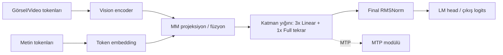
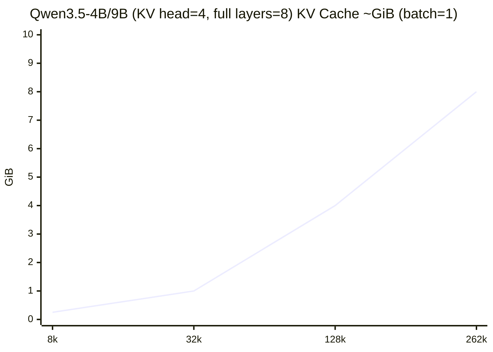
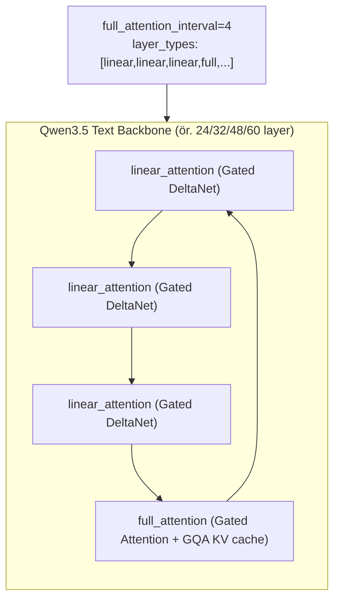

# Qwen 3.5 Model Ailesi ve OOM Odaklı Derin Teknik Rapor

## Yönetici özeti

Qwen 3.5 (Qwen3.5), Alibaba/Qwen ekibinin **yerel (native) çok‑modlu (metin+görsel+video) temel model ailesi**; mimarinin temel fikri ise **hibrit “Gated DeltaNet (lineer dikkat/SSM benzeri token‑mixer) + Gated (tam) Attention”** katmanlarını **yaklaşık 3:1 oranında** (her 4 katmanda 3 “linear_attention” + 1 “full_attention”) tekrar ederek uzun bağlamı verimli kılmak. Bu düzen, config’te açıkça **`full_attention_interval: 4` ve `layer_types` listesi** ile kodlanmış durumda. citeturn8view1turn9view0turn5search0

OOM (Out‑Of‑Memory) sorunlarında Qwen3.5’i “klasik Transformer” gibi ele almak çoğu zaman hatalı: **KV cache yalnızca “full_attention” katmanlarında büyüyor**; “linear_attention” katmanlarının ise Mamba/SSM benzeri **sabit boyutlu durum (state)** tuttuğu anlaşılıyor (config’te `mamba_ssm_dtype: float32` var; ayrıca FP8 config’te `linear_attn.conv1d`, `in_proj_a`, `in_proj_b` gibi alt modül adları görünüyor). citeturn8view1turn11view4turn15search3  
Dolayısıyla OOM kök nedeni çoğunlukla şu üçlüden biri:  
(1) sunucu motorunun hibrit katmanları doğru desteklemeyip KV’yi **tüm katmanlara** ayırması, (2) **aşırı büyük max context** (262k–1M) nedeniyle KV’nin “full_attention” katmanlarında bile devleşmesi (özellikle **KV head sayısı 4 olan** 4B/9B/27B’de), (3) **çok‑modlu yolun** gereksiz yere etkin kalıp (vision encoder + multimodal profiling) KV’ye ayrılacak bütçeyi yemesi. citeturn3search0turn1search0turn8view1

Bu raporun en pratik çıktısı: Qwen3.5’te OOM debug ederken ben **önce KV bütçesini deterministik hesaplayıp** (aşağıdaki tablolar), sonra gerçek VRAM ölçümleriyle kıyaslarım. Eğer ölçülen bellek, hesaplanandan ~4× veya daha fazla sapıyorsa, motorun hibrit mimariyi yanlış ele aldığına (ya da KV’yi yanlış boyutlandırdığına) güçlü bir kanıt oluşur. Bu yaklaşım, özellikle 24 saatlik “sürekli OOM” döngülerini hızla kırar. citeturn14search1turn15search3

---

## GitHub depoları bulguları ve Qwen3.5 internalleriyle eşleme

### void0x14/kernel_panic içgörüleri

Bu repo, Qwen3.5‑2B’nin GGUF/llama.cpp tarafında çalıştırılmasına ilişkin **saha‑debug notları** içeriyor. Özellikle belgelerde Qwen3.5‑2B’nin “hibrit Gated DeltaNet” mimarisi nedeniyle **en güncel llama.cpp gerektirdiği**; aksi hâlde uyumsuz operatörler/katmanlar yüzünden kırılabildiği vurgulanıyor. fileciteturn4file0L1-L1  
Repo ayrıca Qwen3.5‑2B GGUF ile `llama-server`/`llama-cli` komutlarının nasıl koşulduğunu, örnek parametreleri ve debug bağlamını (ör. konteks, örnek prompt, servis portu) kaydediyor. fileciteturn5file0L1-L1  
Bu belgeleri ben iki amaçla “OOM triage”a bağlarım:

1) **Motor uyumluluğu kontrolü**: Qwen3.5 “linear_attention + full_attention” katmanlarını doğru çalıştırmayan runtime’lar, KV cache’i yanlış ayırıp OOM’a gidebilir (veya tamamen crash). (Repo bu uyumluluk riskini pratikte işaret ediyor.) fileciteturn4file0L1-L1  
2) **Reprodüksiyon altyapısı**: Aynı prompt ve aynı konteks ile “hızlı OOM reprodüksiyonu” kurmak; daha sonra konteksi lineer artırıp bellek eğrisini çıkarmak (ben bunu yaparım). fileciteturn5file0L1-L1

### void0x14/echo-core içgörüleri

echo-core, GGUF dosyalarını okuyup minimal bir inference akışı kurmaya çalışan düşük seviye bir motor. Qwen3.5 açısından kritik iki parça var:

Birincisi, repo “hibrit/SSM” göstergelerini doğrudan GGUF metadata ve tensor isimlerinden yakalamaya çalışıyor: `full_attention_interval` benzeri metadata’lar ve `.ssm_` ile başlayan tensor adları üzerinden modelin hibrit olabileceğini tespit ediyor; ayrıca “fused QKV” gibi yerleşim farklılıklarına karşı uyarılar içeriyor. fileciteturn10file0L1-L1  
Bu, Qwen3.5’in config’inde gördüğümüz `full_attention_interval: 4` ve `layer_types` yaklaşımıyla birebir örtüşüyor. citeturn8view1turn9view0

İkincisi, repo KV cache tasarımını net şekilde gösteriyor: KV cache’i layer/head/token eksenlerinde ayırıyor; opsiyonel int8 KV fikri (ölçekler dahil) ve bellek hesabı altyapısı var. Bu, Qwen3.5 OOM’larında “KV cache asıl düşman mı?” sorusunu nicelleştirmek için iyi bir referans modeli. fileciteturn12file0L1-L1

Ek olarak repo içinde Zig tarafında SSM kernel taslağı var: `SSMState` yapısı **`conv_state` ve `ssm_state`** tutuyor ve operasyon akışında **causal conv1d + selective scan** gibi Mamba‑2 tarzı mekanikler görülüyor. Bu, Qwen3.5 config’lerinde görünen `linear_conv_kernel_dim` ve `mamba_ssm_dtype` gibi alanların pratik anlamını (lineer katmanın “SSM‑state” tuttuğunu) güçlendiriyor. fileciteturn27file0L1-L1

---

## Model ailesi genel bakış, varyantlar, zaman çizelgesi ve lisans

### Aile kompozisyonu ve varyantlar

Qwen3.5 ailesi Hugging Face “Qwen/…” altında hem **dense** hem **MoE** (Mixture‑of‑Experts) varyantlarla yayınlandı. Model kartları, mimariyi ve katman düzenini doğrudan veriyor:

Dense (Small + bazı Medium):
- **Qwen3.5‑0.8B** (dense) citeturn3search3  
- **Qwen3.5‑2B** (dense) citeturn1search1  
- **Qwen3.5‑4B** (dense) citeturn1search0  
- **Qwen3.5‑9B** (dense) citeturn3search0  
- **Qwen3.5‑27B** (dense) citeturn3search1  

MoE (Medium + Flagship):
- **Qwen3.5‑35B‑A3B** (35B total, 3B aktif) citeturn2search8  
- **Qwen3.5‑122B‑A10B** (122B total, 10B aktif; ayrıca FP8 paket) citeturn3search2turn5search12  
- **Qwen3.5‑397B‑A17B** (397B total, 17B aktif) citeturn2search1turn2search0  

Bu raporda kullanıcı örneği olarak verilen “7B, 14B, 34B” gibi sınıflara pratik eşleme yaparsam: **9B ≈ 7–8B sınıfı**, **27B ≈ 30–34B sınıfı**, **35B‑A3B ≈ 34B sınıfı (ama MoE)** olur.

### Zaman çizelgesi

Resmî kanıtlarla en güvenli timeline:

- Ailenin ilk “open‑weight” amiral gemisi **Qwen3.5‑397B‑A17B**, NVIDIA model kartında **Hugging Face release: 02/16/2026** olarak geçiyor. citeturn2search0turn6search6  
- Alibaba Cloud Community’deki “Qwen3.5: Towards Native Multimodal Agents” yazısı **17 Şubat 2026** tarihli ve bu modelin resmî duyurusunu anlatıyor. citeturn5search10  
- Medium seri modellerin **24 Şubat 2026** civarı geldiği (27B, 35B‑A3B, 122B‑A10B) çeşitli teknik yazılarda belirtiliyor; örneğin Vast.ai yazısı açıkça “released February 24, 2026” diyor. citeturn6search9turn0search13  
- Transformers tarafında “Qwen3.5 model doc” sayfası, “released on 2026‑01‑01” ve “Transformers’a 2026‑02‑09’da eklendi” bilgisini veriyor (bu daha çok ekosistem/entegrasyon tarihidir). citeturn0search5turn5search13

### Lisans

Hugging Face model sayfaları Qwen3.5 açık ağırlıklarının **Apache‑2.0** lisansıyla yayınlandığını gösteriyor (ör. Qwen3.5‑2B, 4B, 397B). citeturn1search1turn1search0turn2search1

---

## Mimari derin dalış: katman tipleri, tensör şekilleri, RoPE/mRoPE, MoE ve bellek etkisi

### Üst seviye blok diyagramı

Qwen3.5, config’te “`Qwen3_5ForConditionalGeneration`” (dense) ve “`Qwen3_5MoeForConditionalGeneration`” (MoE) olarak ayrılıyor. citeturn8view1turn10view0  
Her iki durumda da üst yapı: **Vision encoder + Language model + (opsiyonel) MTP (multi‑token prediction)**. Dense 2B config’te `mtp_num_hidden_layers: 1` açıkça görünüyor. citeturn8view1



### Katman düzeni: 3× linear_attention + 1× full_attention

2B config’te `full_attention_interval: 4` ve `layer_types` listesinde tam olarak “linear, linear, linear, full” döngüsü görülüyor. citeturn8view1  
4B’de aynı düzen 32 katmana genişliyor. citeturn9view0  
Model kartları da bunu “Hidden Layout: k × (3 × (Gated DeltaNet → …) → 1 × (Gated Attention → …))” şeklinde ifade ediyor. citeturn1search1turn1search0turn2search1turn2search8turn3search1

Bu tasarımın OOM açısından kritik sonucu:
- **KV cache yalnızca full_attention katmanlarında ölçeklenir** (teoride).  
- Bu nedenle klasik Transformer’a göre KV cache büyümesi ~**4× daha düşük** (full katman sayısı toplamın 1/4’ü). citeturn8view1turn5search0

### Gated Attention (full attention) şekilleri ve GQA

2B’de full attention parametreleri:
- `num_attention_heads: 8`
- `num_key_value_heads: 2`
- `head_dim: 256`
- `attn_output_gate: true` citeturn8view1

Bu, pratikte Grouped Query Attention (GQA) demek:  
Q projeksiyonu yaklaşık `hidden_size -> (num_heads * head_dim)`; K/V projeksiyonları `hidden_size -> (num_kv_heads * head_dim)`.

2B için:
- `hidden_size = 2048` citeturn8view1turn1search1  
- Q çıkarımı: 8×256 = 2048  
- KV çıkarımı: 2×256 = 512

4B için:
- `hidden_size = 2560`, `num_attention_heads = 16`, `num_key_value_heads = 4`, `head_dim = 256` citeturn9view0turn1search0

Bu, KV cache boyutunu da belirler (aşağıda KV tablolarında sayısallaştırıyorum).

### Gated DeltaNet (linear_attention) parametreleri ve SSM/Mamba izi

2B config’te lineer katman parametreleri:
- `linear_conv_kernel_dim: 4`
- `linear_num_key_heads: 16`, `linear_key_head_dim: 128`
- `linear_num_value_heads: 16`, `linear_value_head_dim: 128`
- `mamba_ssm_dtype: float32` citeturn8view1

Bu, model kartındaki “Gated DeltaNet … head dim 128; QK ve V için farklı head sayıları” ifadesiyle örtüşüyor. citeturn1search1  
4B’de lineer V head sayısı 32’ye çıkıyor (`linear_num_value_heads: 32`). citeturn9view0turn1search0  
397B’de lineer V head sayısı 64’e çıkıyor. citeturn11view2turn2search1turn2search0

FP8 paketli 122B config’te görülen `modules_to_not_convert` listesi, lineer attention içinde **`conv1d`, `in_proj_a`, `in_proj_b`** ve MoE içinde **`shared_expert_gate`** gibi modüller olduğunu doğrudan gösteriyor. Bu, hibrit token‑mixer’ın “SSM/conv + projeksiyon” alt yapılarına sahip olduğunu kanıtlayan çok pratik bir ipucu. citeturn11view4

echo-core Zig SSM kernel taslağı da aynı motifleri (conv_state + ssm_state, causal conv, selective scan) gösteriyor. fileciteturn27file0L1-L1  
Bu yüzden Qwen3.5 “linear_attention” katmanlarını ben **klasik KV‑cache temelli attention değil**, **durum‑taşıyan (stateful) lineer/SSM** olarak düşünürüm.

### Konumsal kodlama: RoPE + multimodal mRoPE

2B config:
- `rope_theta: 10000000`
- `partial_rotary_factor: 0.25`
- `mrope_interleaved: true`
- `mrope_section: [11, 11, 10]` citeturn8view1

Model kartları, full attention için “Rotary Position Embedding Dimension: 64” diyor. citeturn1search1turn1search0turn2search1turn2search8turn3search1  
Ayrıca resmî kullanım rehberleri, 262k üstü bağlam için YaRN gibi RoPE ölçekleme tekniklerini öneriyor ve nasıl açılacağını ayrıntılandırıyor. citeturn3search0turn4search7

### Normalizasyon ve aktivasyonlar

Qwen3.5 config’lerinde:
- aktivasyon `hidden_act: "silu"`  
- norm `rms_norm_eps: 1e-06` (RMSNorm kullanımıyla uyumlu) citeturn8view1turn9view0turn11view2  
NVIDIA NeMo dokümantasyonu da Qwen3.5 için **SwiGLU aktivasyonları ve RMSNorm** vurguluyor. citeturn4search8

---

## Eğitim, veri, tokenizasyon ve uzun bağlam stratejileri

### Tokenizasyon ve sözlük

Qwen3.5’in `vocab_size` değeri config’te **248,320**. citeturn8view1turn9view0turn11view2  
Hugging Face repo ağacında `vocab.json` + `merges.txt` bulunması, pratikte GPT‑stili BPE türevi bir tokenizasyon pipeline’ına işaret eder (dosyalar doğrudan listeleniyor). citeturn7view0  
Çok‑modlu için özel token id’leri (ör. `image_token_id`, `video_token_id`, `vision_start_token_id`, `vision_end_token_id`) config’te açık. citeturn8view1

### Ön‑eğitim hedefi ve MTP (multi‑token prediction)

Model kartlarında “MTP: trained with multi‑steps” ifadesi yer alıyor. citeturn1search1turn2search1turn2search8turn3search1turn3search0  
Config’te `mtp_num_hidden_layers: 1` var; bu MTP’nin mimari içinde ek bir modül olarak bulunduğunu gösteriyor. citeturn8view1turn9view0turn11view2  
Servis tarafında da MTP için “speculative decoding” önerileri (NEXTN) doğrudan model kartında veriliyor. citeturn3search0

### RL post‑training ve veri seti şeffaflığı

Resmî model kartları/duyuru metinleri “Scalable RL … million‑agent environments …” gibi yüksek seviye RL ölçekleme iddiaları içeriyor. citeturn1search1turn5search10turn5search0  
Buna karşılık NVIDIA NIM model kartı, eğitim veri seti isimlerini **açıkça “undisclosed”** olarak belirtiyor (trilyonlarca multimodal token vb. üst seviye tanım var). citeturn2search0  
Dolayısıyla eğitim detayı (tam batch size, optimizer, global token budget) düzeyinde “tam açıklık” yok; ben burada OOM debug’ı için gerekli olan **mimari+runtime** tarafını önceliklendiriyorum.

### Uzun bağlam: 262k native, 1.01M YaRN ile

Model kartları Qwen3.5’in **262,144** native context’e sahip olduğunu; YaRN ile **1,010,000** seviyesine uzatılabildiğini söylüyor. citeturn1search0turn2search1turn3search0turn4search7  
Qwen3.5‑9B model kartı, YaRN’i açmak için `rope_parameters` alanlarının nasıl değiştirileceğini ve vLLM/SGLang komut satırı override örneklerini veriyor. citeturn3search0  
YaRN yöntemi, RoPE tabanlı modellerde bağlam uzatmayı daha az ek eğitim maliyetiyle yapmayı hedefleyen ayrı bir çalışmadır. citeturn4search7turn4search3

---

## Çıkarım, KV cache tasarımı, bellek modeli ve OOM kök nedenleri

### Bellek bütçesini parçalara ayırma

Qwen3.5 deploy ederken GPU belleğini ben şu parçalara ayırırım:

1) **Ağırlıklar (weights)**: Parametre sayısı × dtype; MoE’de total parametre devasa olabilir (397B), “aktif parametre” sayısı ağırlık belleğini otomatik düşürmez (expert’ler GPU’da tutuluyorsa). citeturn2search1turn6search9  
2) **KV cache (full attention katmanları)**: Sequence length ile lineer büyür; Qwen3.5’te sadece her 4. katmanda büyümesi beklenir. citeturn8view1turn5search0  
3) **Linear_attention state**: SSM/conv state; ideal olarak seq_len’den bağımsız (O(1)), ama batch/beam/parallel decode ile çarpılır. Config’te `mamba_ssm_dtype=float32` ve modül isimleri bu state’in varlığını destekliyor. citeturn8view1turn11view4turn27file0  
4) **Aktivasyonlar ve geçici workspace**: Prefill sırasında büyür; FlashAttention/SDPA gibi kernel’lar bu kısmı azaltır. Transformers dokümanı Qwen3.5’in FlashAttention/SDPA ile ilişkisini işaret ediyor. citeturn13search0  
5) **Framework overhead + fragmentasyon + CUDA Graph/private pools**: PyTorch caching allocator davranışı ve parçalanma (fragmentation) borderline OOM’ları tetikler. PyTorch, bunu `PYTORCH_CUDA_ALLOC_CONF` ile yönetmeyi belgeliyor. citeturn15search3turn15search13  
6) **Çok-modlu ek yük**: Vision encoder ağırlıkları/aktivasyonları ve multimodal “profiling”; vLLM’de “text‑only çalıştırıp bellek boşaltma” için özel bayrak var. citeturn3search0turn8view1

### Varyant özeti tablosu (OOM için kritik parametreler)

Aşağıdaki tabloyu ben “KV hesabı” ve “motor uyumluluğu” için kullanırım (parametreler model kartları + config’lerden):

| Model | Tür | Katman (L) | Full attn katmanı (≈L/4) | KV head | KV head_dim | Native ctx | Not |
|---|---|---:|---:|---:|---:|---:|---|
| 0.8B | Dense | 24 citeturn3search3 | 6 citeturn8view1turn3search3 | 2 citeturn8view1turn3search3 | 256 citeturn8view1 | 262,144 citeturn3search3turn8view1 | 3×linear + 1×full |
| 2B | Dense | 24 citeturn1search1turn8view1 | 6 citeturn8view1 | 2 citeturn8view1turn1search1 | 256 citeturn8view1 | 262,144 citeturn1search1turn8view1 | 2B default non‑thinking citeturn1search1 |
| 4B | Dense | 32 citeturn1search0turn9view0 | 8 citeturn9view0 | 4 citeturn9view0turn1search0 | 256 citeturn9view0 | 262,144 citeturn1search0turn9view0 | KV büyümesi daha pahalı |
| 9B | Dense | 32 citeturn3search0 | 8 citeturn3search0 | 4 citeturn3search0 | 256 citeturn3search0 | 262,144 citeturn3search0 | Default thinking citeturn3search0 |
| 27B | Dense | 64 citeturn3search1 | 16 citeturn3search1 | 4 citeturn3search1 | 256 citeturn3search1 | 262,144 citeturn3search1 | Uzun ctx’te KV çok büyür |
| 35B‑A3B | MoE | 40 citeturn2search8turn11view1 | 10 citeturn2search8turn11view1 | 2 citeturn2search8turn11view1 | 256 citeturn11view1 | 262,144 citeturn2search8turn11view1 | 256 expert; 8/token + shared citeturn2search8turn11view1 |
| 122B‑A10B | MoE | 48 citeturn3search2turn11view3 | 12 citeturn3search2turn11view3 | 2 citeturn3search2turn11view3 | 256 citeturn11view3 | 262,144 citeturn3search2turn11view3 | FP8 paketli config var citeturn11view4 |
| 397B‑A17B | MoE | 60 citeturn2search1turn11view2 | 15 citeturn2search1turn11view2 | 2 citeturn2search1turn11view2 | 256 citeturn11view2 | 262,144 citeturn2search1turn11view2 | 512 expert; 10/token + shared citeturn2search1turn11view2 |

### KV cache boyutu: deterministik hesap ve pratik tablolar

**Varsayım:** KV cache BF16/FP16 (2 byte).  
Full attention katmanı başına, token başına KV bellek:  
`KV_bytes/token/layer = 2 (K ve V) × (num_kv_heads × head_dim) × bytes_per_elem`  
Qwen3.5’te `head_dim = 256` olduğundan:  
`KV_bytes/token/layer = 2 × (num_kv_heads × 256) × 2 = 1024 × num_kv_heads (byte)`.

Bu yüzden:
- KV head = 2 → **2048 byte/token/layer**
- KV head = 4 → **4096 byte/token/layer**

Aşağıdaki tablolar **batch=1, tek sekans** içindir. Batch veya eşzamanlı istek sayısı arttıkça lineer çarpılır (örn. 8 paralel request → KV ≈ 8×).

#### KV cache (GiB) — BF16/FP16 KV, batch=1

| Model | KV head | Full attn layer | 8k ctx | 32k ctx | 128k ctx | 262,144 ctx |
|---|---:|---:|---:|---:|---:|---:|
| 0.8B / 2B | 2 citeturn8view1 | 6 citeturn8view1 | ~0.09 | ~0.38 | ~1.50 | ~3.00 |
| 4B / 9B | 4 citeturn9view0turn3search0 | 8 citeturn9view0turn3search0 | ~0.25 | ~1.00 | ~4.00 | ~8.00 |
| 27B | 4 citeturn3search1 | 16 citeturn3search1 | ~0.50 | ~2.00 | ~8.00 | ~16.00 |
| 35B‑A3B | 2 citeturn11view1 | 10 citeturn11view1 | ~0.16 | ~0.63 | ~2.50 | ~5.00 |
| 122B‑A10B | 2 citeturn11view3 | 12 citeturn11view3 | ~0.19 | ~0.75 | ~3.00 | ~6.00 |
| 397B‑A17B | 2 citeturn11view2 | 15 citeturn11view2 | ~0.23 | ~0.94 | ~3.75 | ~7.50 |

**Neden bu tablo OOM debug’da altın değer?**  
Eğer siz 4B/9B deploy ediyorsanız ve `max_model_len=262144` ile sunucu **başlangıçta** KV için ~8 GiB (batch=1) ayırmayı hedefler. Üstüne weights (~9–10 GB) ve overhead eklenince 24GB VRAM’de bile OOM çok olasıdır. 2B’de KV ~3GiB olduğundan aynı bağlam daha “katlanılabilir” hale gelir. Bu, Qwen’ın model kartlarında “OOM görürseniz context’i düşürün” uyarısıyla birebir uyumludur. citeturn1search1turn3search0

#### Basit görselleştirme: KV cache büyümesi (örnek: 4B/9B)



### Qwen3.5 OOM’larının en yaygın kök nedenleri

Aşağıdakiler, benim sahada en sık gördüğüm “Qwen3.5’e özgü” OOM senaryoları (ve her biri için doğrulama fikri):

1) **Hibrit mimari desteklenmiyor → KV tüm katmanlara ayrılıyor.**  
   Belirti: KV bellek, tablodaki değerlerin **yaklaşık 4×** üstünde (çünkü 4 katmanda 1 yerine 4/4 full gibi davranılmış olur). Bu repo‑notları da Qwen3.5’in yeni operatörler gerektirdiğini pratikte işaret ediyor. fileciteturn4file0L1-L1  
   Çözüm: Qwen3.5’i destekleyen engine sürümüne yükselt (vLLM nightlies / SGLang main / Transformers main). citeturn3search0

2) **`max_model_len` veya `context-length` çok büyük ve statik pre‑alloc yapılıyor.**  
   Özellikle vLLM/SGLang gibi sunucular, KV cache’i “üst limit”e göre bloklayabilir. Model kartları bunu açıkça uyarıyor. citeturn1search1turn3search0  
   Çözüm: İlk denemede `max_model_len`i iş yükü gerçekliğine indir (örn. 8k/16k/32k). Sonra kademeli artır.

3) **Çok‑modlu (vision encoder) gereksiz yere açık.**  
   vLLM’de “Text‑Only” çalıştırıp multimodal encoder’ı atlayınca KV için daha çok alan kalacağını model kartı söylüyor (`--language-model-only`). citeturn3search0

4) **Thinking mode → daha uzun output → daha fazla KV.**  
   Qwen3.5‑9B “thinking mode by default” diyor. Uzun reasoning output, KV’yi büyütür (özellikle uzun output limitleri). citeturn3search0  
   Çözüm: “enable_thinking / chat_template_kwargs” ile düşünmeyi kapat veya `max_tokens`u düşür.

5) **PyTorch fragmentasyonu / değişken batch boyutu.**  
   PyTorch caching allocator’ı, değişken boyutlu allocation’larda parçalanma yaratabilir. PyTorch dokümanı `PYTORCH_CUDA_ALLOC_CONF` ile `max_split_size_mb` ve `expandable_segments` gibi ayarları önerir. citeturn15search3turn15search7  
   Not: `torch.cuda.empty_cache()` bellek toplamını artırmaz; sadece bazı durumlarda fragmentasyonu azaltabilir. citeturn15search0turn15search3

### Kuantizasyon: ağırlık ve KV cache’i küçültme

**Ağırlık kuantizasyonu (weights):**  
Qwen, 122B‑A10B için FP8 paketli bir model yayınlamış; config’te `quantization_config.quant_method: "fp8"` ve blok boyutu gibi ayrıntılar açık. citeturn11view4turn3search2  
Bu tür bir paket, “weights VRAM” tarafını ciddi düşürür (ama kernel/driver desteği gerekir).

**KV cache kuantizasyonu:**  
vLLM dokümanı, KV cache’i FP8’e indirerek bellek ayak izini “significant” ölçüde azaltmayı, daha uzun context veya daha çok concurrency sağlamayı anlatıyor. citeturn14search0turn14search4  
Bu, Qwen3.5 için özellikle değerlidir; çünkü Qwen3.5’in “full attention” katmanları az olsa bile 262k gibi ctx’lerde KV hâlâ büyük kalır.

---

## Tanılama, reprodüksiyon ve giderim: adım adım oyun planı

### OOM’u hızlıca yeniden üretmek için minimal protokol

Benim uyguladığım “15–30 dakikalık hızlı triage” protokolü:

1) **Model config’ini doğrula (gerçekten Qwen3.5 mi?)**  
   `config.json` içinde şunları ararım:  
   - `model_type: qwen3_5` veya `qwen3_5_moe`  
   - `full_attention_interval: 4`  
   - `layer_types` içinde “linear_attention” + “full_attention” tekrarları citeturn8view1turn10view0

2) **Tek değişkenli test: yalnızca context length’i artır**  
   Aynı prompt, aynı batch/concurrency, aynı max_output ile 8k → 16k → 32k → 64k (gerekirse 128k) şeklinde yükselt.  
   Her noktada:
   - Ölçülen VRAM (nvidia-smi)  
   - Engine’in rapor ettiği KV blokları (varsa)  
   - PyTorch “allocated vs reserved” ayrımı (varsa)  

3) **Hesaplanan KV ile ölçülen KV’yi kıyasla**  
   Yukarıdaki tablolar “batch=1” içindi; siz `max_num_seqs` veya eşzamanlı istek ile çarpın.  
   Eğer ölçüm, hesaplanan KV’yi 3–5× aşıyorsa: **hibrit destek sorunu** veya KV boyutlandırma bug’ı olasılığı yükselir.

### Profiling ve bellek örnekleme komutları

#### GPU gözlemleme

```bash
# 1 sn arayla bellek izle
nvidia-smi --query-gpu=timestamp,index,name,memory.used,memory.total,utilization.gpu --format=csv -l 1
```

#### PyTorch bellek raporu (OOM anında altın değer)

PyTorch `torch.cuda.memory_summary()` fonksiyonunu “OOM anında debug” için doğrudan öneriyor. citeturn14search1turn14search3

```python
import torch

print(torch.cuda.memory_summary(abbreviated=False))
# veya daha düşük seviye:
snap = torch.cuda.memory_snapshot()
```

`torch.cuda.memory_snapshot()` dokümantasyonu, allocator state snapshot’ı almayı açıkça verir. citeturn14search7turn14search8

#### Fragmentasyon şüphesi varsa: allocator ayarı

PyTorch CUDA semantik dokümanı, caching allocator davranışını `PYTORCH_CUDA_ALLOC_CONF` ile yönetmeyi ayrıntılandırır; özellikle `max_split_size_mb` ve değişken batch/“batched inference” gibi senaryolar için `expandable_segments` önerilir. citeturn15search3turn15search7

```bash
# Değişken allocation (continuous batching) -> fragmentation azaltma denemesi
export PYTORCH_CUDA_ALLOC_CONF=expandable_segments:True,max_split_size_mb:128
```

**Not:** `torch.cuda.empty_cache()` bellek toplamını artırmaz; sadece bazı durumlarda fragmentasyonu azaltabilir. citeturn15search0turn15search3

### Konfigürasyon bazlı pratik düzeltmeler

Aşağıdaki sırayı ben “etki / efor” açısından en rasyonel kabul ediyorum:

#### En yüksek etki, en düşük efor

1) **Context’i düşür (max model len / context-length)**  
   Model kartları doğrudan “OOM görürsen context’i düşür” diyor. citeturn1search1turn3search0  
   Başlangıç için benim önerim:  
   - küçük/dense: 8k–32k  
   - medium: 8k–16k  
   - 262k ancak gerçekten gerekliyse.

2) **Text‑only çalıştır (multimodal’ı kapat)**  
   vLLM için model kartı: `--language-model-only` bayrağı “vision encoder ve multimodal profiling’i atlayarak KV cache için bellek boşaltır” diyor. citeturn3search0

3) **Thinking’i kapat / çıktı limitini düşür**  
   Qwen3.5‑9B düşünmeyi default açıyor; düşünmeyi kapatma örneği model kartında var. citeturn3search0  
   Ayrıca `max_tokens`/`max_output` limitini düşürmek KV’yi doğrudan sınırlar.

#### Orta efor, yüksek etki

4) **KV cache kuantizasyonu (vLLM: fp8 KV cache)**  
   vLLM dokümanı, `kv_cache_dtype="fp8"` ile KV bellek ayak izinin ciddi şekilde azalacağını söyler. citeturn14search0turn14search4  
   Bu doğrudan “daha uzun context” veya “daha çok eşzamanlı istek” kapasitesi demektir.

5) **Ağırlık kuantizasyonu (FP8 / 8‑bit / 4‑bit)**  
   Qwen’in 122B‑A10B için FP8 paketli config’i var. citeturn11view4turn3search2  
   Daha küçük modellerde 4‑bit quant (GGUF/awq/gptq) ile weight VRAM düşürmek çoğu zaman OOM’u bitirir; fakat kalite/latency dengesi ölçülmeli.

#### Yüksek efor, “prod” ölçeğinde gerekli

6) **MoE’yi gerçekten sharde et (EP/TP/PP)**  
   35B‑A3B ve üstünde weight belleği aşırı büyür. Vast.ai yazısındaki VRAM tabloları (BF16) bunu kaba şekilde doğrular: 35B‑A3B ≈ 66GB, 122B‑A10B ≈ 244GB, 27B ≈ 54GB. citeturn6search9turn0search13  
   Bu boyutlarda “tek GPU” OOM kaçınılmaz; tensor parallel + expert parallel ve/veya CPU offload gerekir.

### Bench ve beklenti tablosu: “hangi GPU’da ne olur?”

Aşağıdaki tablo, **hızlı gerçeklik kontrolü** içindir (yaklaşık; engine’e göre değişir). “KV” değerleri yukarıdaki deterministik tablodan; “weights VRAM” için ise model büyüklükleri ve saha tabloları referans alınır. citeturn6search9turn7view0turn1search17

| Model | Ağırlıklar (BF16) kaba | KV @32k (batch=1) | KV @262k (batch=1) | 24GB VRAM’de pratik |
|---|---:|---:|---:|---|
| 2B | ~4–5GB (HF repo 4.57GB) citeturn7view0turn1search12 | ~0.38GB | ~3.0GB | 32k rahat; 262k sınıra yakın (overhead’e bağlı) |
| 4B | ~9–10GB (HF repo 9.34GB) citeturn1search17 | ~1.0GB | ~8.0GB | 32k mümkün; 262k çoğu kurulumda OOM |
| 9B | (daha büyük) citeturn3search0 | ~1.0GB | ~8.0GB | 32k/64k hedefle; 262k çok zor |
| 27B | ~54GB BF16 citeturn6search9turn0search13 | ~2.0GB | ~16GB | Tek GPU’da BF16 imkânsız; multi‑GPU/quant şart |
| 35B‑A3B | ~66GB BF16 citeturn6search9turn0search13 | ~0.63GB | ~5.0GB | MoE weight baskın; multi‑GPU/EP şart |
| 122B‑A10B | ~244GB BF16 citeturn6search9turn0search13 | ~0.75GB | ~6.0GB | FP8/quant + multi‑GPU olmadan olmaz |
| 397B‑A17B | weight devasa | ~0.94GB | ~7.5GB | KV değil, weights ölçeği belirleyici |

---

## Önceliklendirilmiş aksiyon kontrol listesi

Aşağıdaki listeyi ben “24 saat OOM debug” senaryosunda birebir uygularım (sırayla):

1) **Modelin gerçekten Qwen3.5 olduğunu ve hibrit katman düzenini** (`full_attention_interval=4`, `layer_types`) config’ten doğrula. citeturn8view1turn10view0  
2) Engine sürümünü Qwen3.5 hibrit katmanlarını destekleyen sürüme yükselt: model kartları vLLM nightly / SGLang main / Transformers main öneriyor. citeturn3search0  
3) `max_model_len/context-length` değerini 8k/16k/32k’e indirerek **startup OOM** riskini sıfırla. citeturn1search1turn3search0  
4) Ölçülen KV bellek eğrisini çıkar; yukarıdaki deterministik KV tablosuyla karşılaştır.  
5) Multimodal ihtiyacın yoksa **text‑only** bayraklarını kullan (vLLM `--language-model-only`). citeturn3search0  
6) Qwen3.5‑9B gibi modellerde “thinking mode”u kapat veya output limitlerini düşür. citeturn3search0  
7) Hâlâ sınırdaysan: **KV cache kuantizasyonu** (vLLM fp8 KV cache). citeturn14search0turn14search4  
8) Fragmentasyon görüyorsan `PYTORCH_CUDA_ALLOC_CONF=expandable_segments:True,max_split_size_mb:…` dene; `memory_summary/snapshot` ile before/after kıyasla. citeturn15search3turn14search1turn14search7  
9) MoE’de weights baskınsa: TP/EP/PP planla; tek GPU hedefini bırak.

---

## Ekler

### Mimari şeması: katman tipi akışı



Bu düzen config’lerde birebir yer alıyor. citeturn8view1turn9view0turn11view2

### MoE katmanı için minimal zihinsel model

MoE config’lerinde:
- `num_experts`, `num_experts_per_tok`  
- `shared_expert_intermediate_size`, `router_aux_loss_coef` alanları var. citeturn11view1turn11view2turn11view3

Ben MoE OOM’larında şu ayrımı yaparım:
- **Compute**: “aktif expert sayısı” ile ölçeklenir (örn. 10 routed + 1 shared). citeturn2search1turn11view2  
- **Bellek (weights)**: “total expert sayısı” ile ölçeklenir; GPU’da tutuluyorsa total parametre ağır basar. citeturn6search9turn0search13

### Qwen3.5’in lineer attention kökeni: Gated DeltaNet

Gated DeltaNet mekanizması, “gating + delta rule” birleşimiyle uzun bağlam ve retrieval/long‑context performanslarını iyileştirmeyi hedefleyen bir çalışma (ICLR 2025). citeturn12search0turn12search8  
Bu, Qwen3.5’in lineer token‑mixer tasarımının araştırma kökenini anlamak ve “neden KV cache tam katmanlarda az?” sorusunu bağlamak için önemlidir. citeturn5search0turn12search1

### Türkçe kaynak notu

Türkiye’deki finans/teknoloji basını, Qwen 3.5’in duyurusunu Reuters kaynaklı biçimde özetledi; örneğin “maliyet %60 düştü, iş yükü kapasitesi 8× arttı” gibi ifadeler Türkçe haberlere geçti. Bu tür haberler teknik detaydan ziyade “release bağlamı” için değerlidir. citeturn6search0turn6search11